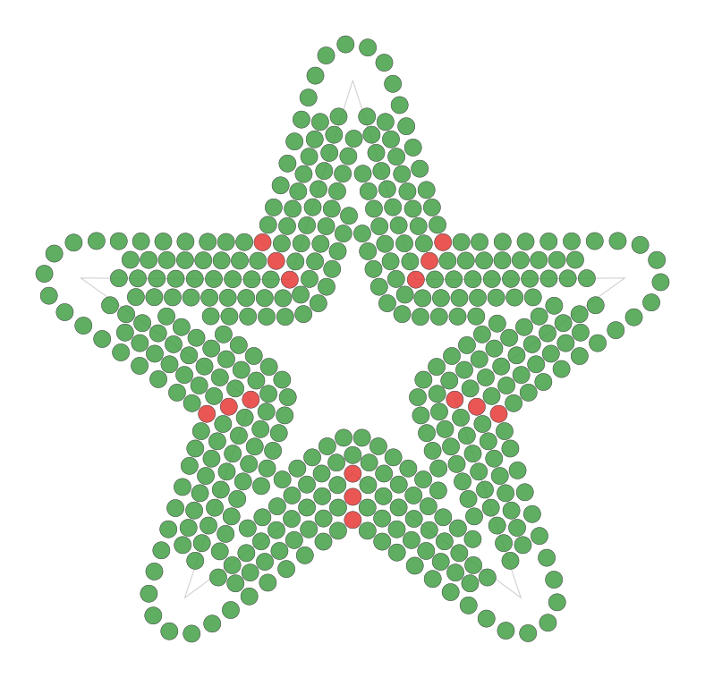
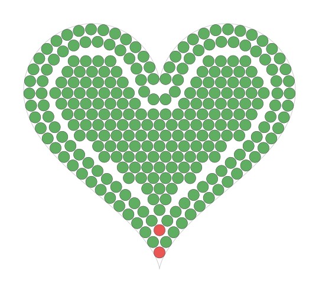
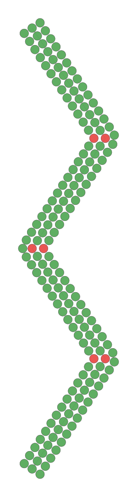
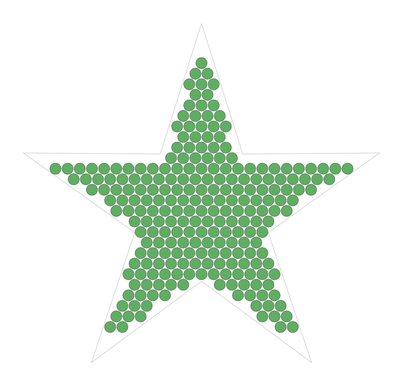
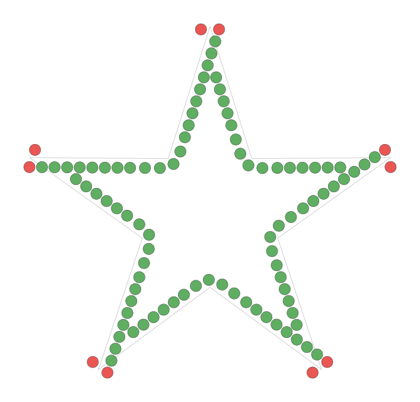
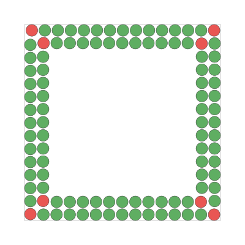
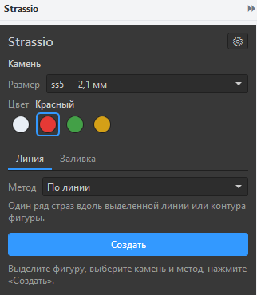

<p align="center">
  
</p>

<h1 align="center">Strassio</h1>

<p align="center">
  Плагин для CorelDRAW, который превращает линии и фигуры в шаблоны страз.<br>
  Каждая страза — обычный круг нужного диаметра, готовый для резки шаблона.
</p>

<p align="center">
  <a href="https://github.com/little-7o7/strassio/releases">Скачать</a> ·
  <a href="docs/CHANGELOG.md">Что нового</a> ·
  <a href="docs/SPEC.md">Техническое задание</a> ·
  <a href="#english">English</a>
</p>

---

> **Статус: бета, в разработке.** Готовы расстановка по линиям и заливки, докер с параметрами,
> правка и перекраска камней. Лицензия и автообновление — впереди (см. [что дальше](#что-дальше)).

## Что умеет

Нарисуйте линию или фигуру, выберите камень (размер и цвет) и метод, нажмите **«Создать»**.
Стразы появятся одной группой с понятным именем (`Strassio: линия ss6 Красный`),
у каждого круга имя вида `ss6 Красный`. Один **Ctrl+Z** отменяет всю операцию.

<table>
  <tr>
    <td align="center"><br><sub>Вокруг линии — 5 рядов, шахматный сдвиг</sub></td>
    <td align="center"><br><sub>Комбинированная заливка</sub></td>
    <td align="center"><br><sub>Вокруг линии — острые углы зигзага</sub></td>
  </tr>
  <tr>
    <td align="center"><br><sub>Соты</sub></td>
    <td align="center"><br><sub>По смещённой линии — внутрь</sub></td>
    <td align="center"><br><sub>Кант — 2 ряда по краю</sub></td>
  </tr>
</table>

### Стразы по линии

| Метод | Что делает |
|---|---|
| **По линии** | Один ряд вдоль линии или контура. Шаг: подгонка без дырки в конце, точный шаг или точное количество. |
| **Вокруг линии** | Несколько рядов в обе стороны, только наружу или только внутрь; шахматный сдвиг; круглые или острые углы. |
| **По смещённой линии** | Один ряд на заданном расстоянии от линии — снаружи или внутри фигуры. |
| **Каллиграфия** | Число рядов меняется вдоль линии: живой мазок вместо «трубы». |
| **Переход размера** | ss10 → ss6 → ss5 вдоль линии — стебли, кончики листьев. |
| **Чередование размеров** | По шаблону, например «ss6, ss6, ss10». |
| **Пунктир** | Группы по N камней, пропуск M. |
| **Акценты** | Крупный камень на концах линии и в углах. |

### Заливка формы

| Метод | Что делает |
|---|---|
| **Сетка** | Квадратная сетка с поворотом на любой угол. |
| **Соты** | Плотная шахматная заливка. |
| **Контурная** | Ряды от края внутрь, повторяя форму; середина — соты или сетка. |
| **Комбинированная** | N рядов по краю + соты или сетка внутри. |
| **Кант** | Только N рядов по краю, внутри пусто. |
| **По центральной линии** | Ряды вдоль середины формы — стебли, лепестки, буквы. |
| **Переход между кривыми** | Ряды плавно перетекают от одной линии к другой. |
| **По направляющей** | Ряды внутри формы повторяют изгиб нарисованной линии. |
| **От центра** | Кольца или спираль. |
| **Случайная плотная** | Без наложений, можно смешать несколько размеров. |
| **Градиент размера** | Крупные в центре, мелкие к краю. |
| **Добивка щелей** | Соты + мелкие камни в щелях у края. |

У сетки и сот — **автоподбор**: плагин сам ищет сдвиг и поворот, при которых у края меньше дыр.

Отверстия в фигурах (буквы «О», «А», кольца) остаются пустыми.

### Острые углы и наложения

- В каждом остром углу страза ставится точно в вершину, отрезки между углами заполняются отдельно —
  угол остаётся углом. Замкнутые контуры заполняются равномерно, без «шва».
- Стразы не налезают друг на друга. Для нескольких рядов можно выбрать, что делать с наложениями:
  **удалить лишние** (соседи раздвигаются, дырки не остаётся), **сдвинуть** или **только показать** —
  такие стразы получат красную обводку.

### Правка и цвет

- **Пять режимов удаления наложений:** оставить верхние или нижние, удалить по линии-«ножу»,
  удалить внутри или снаружи формы, сдвинуть вместо удаления.
- **Удаление дублей** после копирования, **закрепление** камней, которые нельзя трогать.
- **Заполнение дырок** внутри рисунка одним кликом, **возврат размера** камням после масштабирования.
- **«Живые» стразы**: поправили линию — нажали «Обновить», камни перестроились.
- **Перекраска**, **пипетка**, **смешение цветов** (70% / 30% или по шаблону), **выделение** всех камней
  нужного размера и/или цвета, цвета камней — в палитру документа.

### Докер



- Выбор камня: размер из вашей таблицы (`ss6 — 2,4 мм`) и цвет кружками-образцами.
- **Редактор таблицы камней** прямо в плагине: размеры и цвета — добавить, изменить, удалить,
  поменять порядок; цвет можно выбрать или ввести (`#E53935`, `229, 57, 53`).
- Вкладки «Линия» и «Заливка»; у каждого метода — картинка-схема, только нужные ему параметры
  и подсказки. Все параметры, последний камень и метод запоминаются.
- **Предпросмотр** — картинка будущих страз прямо в докере, документ не меняется; **живой** —
  обновляется сам при каждом изменении.
- **Русский и английский** интерфейс, переключается без перезапуска CorelDRAW.
- **Миллиметры или дюймы** — поля и таблица камней пересчитываются.
- **Тема как у CorelDRAW:** докер берёт цвета текущей схемы CorelDRAW и сам меняется вместе с ней.
- **Вертикальная или горизонтальная** раскладка — для докера сбоку или внизу.
- **Экспорт и импорт** настроек и таблицы камней одним файлом — перенос на другой компьютер.
- Обводка страз: нет, волосяная или заданной толщины.

Таблица камней хранится в `%APPDATA%\Strassio\stones.json`: у каждого размера свой список цветов.

<br clear="right">

## Установка

1. Скачайте `Strassio-Setup-<версия>.exe` со страницы [Releases](https://github.com/little-7o7/strassio/releases).
2. Закройте CorelDRAW и запустите установщик. Он сам найдёт установленные версии CorelDRAW
   и предложит выбрать, куда ставить.
3. Откройте CorelDRAW и нажмите кнопку-камень на панели **Strassio** —
   или меню **Окно → Докеры → Strassio**.

**Совместимость:** цель — все версии CorelDRAW начиная с X7 (32 и 64 бита). Сейчас проверяется на CorelDRAW 2025 и 2026.
Подробнее — [docs/УСТАНОВКА.md](docs/УСТАНОВКА.md).

## Что дальше

| Этап | Что | Статус |
|---|---|---|
| 0 | Каркас, кнопка, докер, одна DLL на все версии CorelDRAW | ✅ готово |
| 1 | Ядро: линии, заливки, острые углы, исправление наложений | ✅ готово |
| 2 | Докер: камень, методы, параметры, настройки, языки, темы | ✅ готово |
| 3 | Правка и цвет | ✅ готово |
| 4 | Прокачка линий и заливок | ✅ готово |
| 5 | Инструменты и подготовка к производству | 🔧 в работе |
| 6 | Лицензия и обновления | |
| 7 | Бета-тест с мастерами | |

### Доделать в докере (Этап 2)
- ✅ Предпросмотр, редактор таблицы камней, картинки-схемы методов, горизонтальная раскладка,
  экспорт и импорт настроек.
- Проверка всего этого автором в CorelDRAW 2025 и 2026.
- Проверка на старых версиях CorelDRAW (X7, X8) и 32-битных.

### Правка и цвет (Этап 3) — ✅ готово
- **Пять режимов удаления:** оставить верхние / оставить нижние, удалить по линии («разрезать»
  заливку), удалить внутри или снаружи формы, сдвинуть вместо удаления.
- Удаление дублей после копирования; **закрепление камней**, которые нельзя трогать.
- **Перекрасить** выделенные камни; выделить все камни нужного размера, цвета или размера+цвета.

### Прокачка линий и заливок (Этап 4) — ✅ готово
- **Каллиграфия** — число рядов меняется вдоль линии: живые мазки вместо «трубы» одинаковой ширины.
- **Переход размера** вдоль линии (ss10 → ss6 → ss5) — стебли, кончики листьев.
- **Чередование размеров** по шаблону (ss6, ss6, ss10), **пунктир**, **акценты** — крупный камень
  на концах и в углах; разный размер камня для каждого ряда.
- Новые заливки: по центральной линии, переход между двумя кривыми, по направляющей,
  от центра (кольца, спираль), случайная плотная, градиент размера (крупные в центре — мелкие к краю),
  добивка щелей мелкими камнями.
- **Автоподбор сетки** — плагин сам ищет сдвиг и угол, при которых у края меньше дыр.
- **Живой предпросмотр** — результат обновляется сразу при изменении параметров.
- **«Живые» стразы** — поправили линию, нажали «Обновить», камни перестроились.
- **Масштабирование без порчи диаметров** — дизайн меняет размер, камни остаются правильными.
- **Поиск дырок** — подсветить пустые места, куда помещается камень, и заполнить одним кликом.
- Цвет: пипетка камня, случайное смешение цветов (70% кристалл / 30% золото),
  чередование цветов по шаблону, цвета камней в палитре документа.

### Инструменты и производство (Этап 5)
- Подготовка линий: сглаживание, центральная линия из буквы, соединить концы, разрезать на части,
  параллельные линии, смещение контура, проверка самопересечений и мусорных объектов.
- **Проверка перемычек** — где между отверстиями слишком тонко и трафарет порвётся.
- **Раскладка по слоям по размерам** — удобно для ArtCAM; «чистые» круги без лишних групп.
- **Пресеты** («Стебель тонкий», «Лепесток плотный») и история последних настроек.
- Обводка всего дизайна рядом страз; несколько таблиц камней (под разных поставщиков).

### Потом
Мотивы (цветы, листики, завитки — по линии, по кругу, рамки), симметрия, россыпь «брызгами»,
растворение к краю, цветные полосы.

Полный список — в [техническом задании](docs/SPEC.md). Есть идея или нашли ошибку —
пишите в [Issues](https://github.com/little-7o7/strassio/issues).

## Для разработчиков

```
src/Strassio.Core/        геометрия и алгоритмы — не знает о CorelDRAW (netstandard2.0)
src/Strassio.Corel/       аддон CorelDRAW: кнопка, докер WPF (net48, AnyCPU)
src/Strassio.Licensing/   клиент лицензии и обновлений
tests/Strassio.Core.Tests xUnit
tools/Strassio.Preview/   рисует результат алгоритмов в SVG — без CorelDRAW
installer/                установщик Inno Setup
lang/                     тексты интерфейса (ru.json, en.json)
```

Нужен [.NET 8 SDK](https://dotnet.microsoft.com/download); для установщика — [Inno Setup 6](https://jrsoftware.org/isdl.php).

Для сборки аддона нужен файл interop CorelDRAW `Corel.Interop.VGCore.dll` — это файл Corel,
поэтому его нет в репозитории. Положите его в `src/Strassio.Corel/interop/`. Проект собирается
против interop самой старой поддерживаемой версии (сейчас CorelDRAW 2018) — так одна DLL
работает во всех версиях. Ядро, тесты и Preview собираются и без него.

```powershell
dotnet build Strassio.sln                                     # сборка
dotnet test tests/Strassio.Core.Tests                         # тесты ядра
dotnet run --project tools/Strassio.Preview -- methods        # все методы в SVG → out/preview/methods/
dotnet run --project tools/Strassio.UiShots                   # снимки докера и окон без CorelDRAW → out/ui/
powershell -ExecutionPolicy Bypass -File installer\build-installer.ps1   # установщик → installer/out/
```

Вся геометрия живёт в `Strassio.Core` и сначала проверяется тестами и SVG-картинками,
и только потом подключается к CorelDRAW. Внутри всё считается в миллиметрах.
Правила проекта — в [CLAUDE.md](CLAUDE.md).

## Лицензия

© 2026 Munisxonov Maxmudxon. Все права защищены. Исходный код открыт для просмотра;
использование, копирование и распространение — только с письменного разрешения автора.

---

<a name="english"></a>
## English

**Strassio** is a CorelDRAW add-on that turns lines and shapes into rhinestone templates.
Every stone is a plain circle of the right diameter, ready for template cutting.

- **Along lines:** single row, several rows around a line (both sides / outside / inside, staggered),
  offset row. Exact step, exact count or fit-to-length. Stones land exactly on sharp corners.
- **Shape fills:** grid, honeycomb, contour, combined (edge rows + grid inside), border.
  Holes stay empty.
- **No overlaps:** remove extra stones (neighbours close the gap), shift them, or just highlight them.
- **Docker:** stone size and colour from your own stone table, per-method parameters,
  Russian and English UI, mm or inches, follows the CorelDRAW colour scheme.
- One operation = one group = one Ctrl+Z.

Targets CorelDRAW X7 and newer (32/64-bit); currently tested on CorelDRAW 2025 and 2026. Status: beta, under active development.
Download the installer from [Releases](https://github.com/little-7o7/strassio/releases).

© 2026 Munisxonov Maxmudxon. All rights reserved. Source is visible for reference only;
use, copying and redistribution require the author's written permission.
